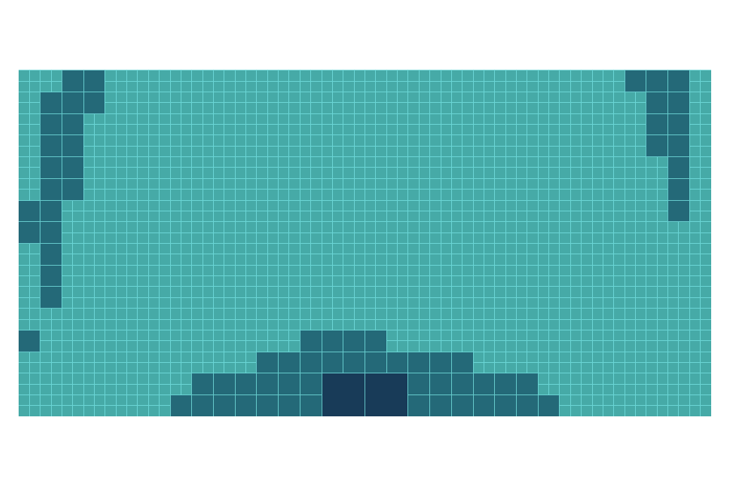
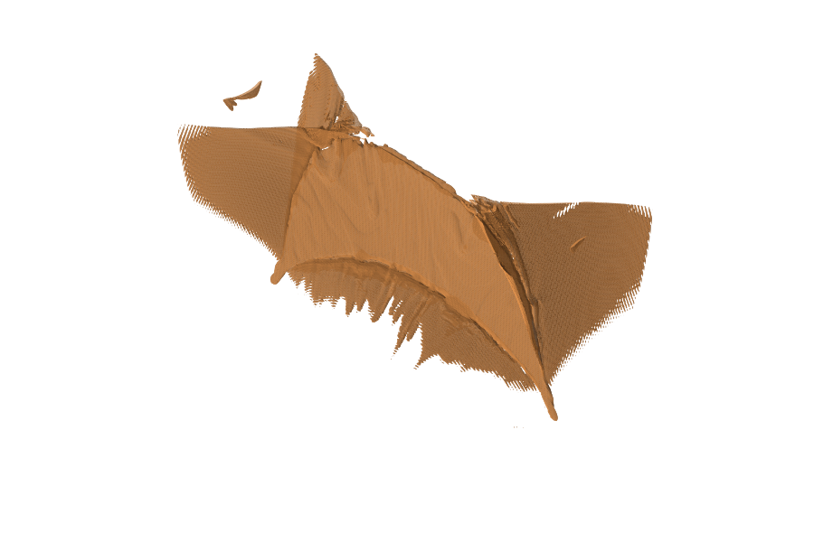
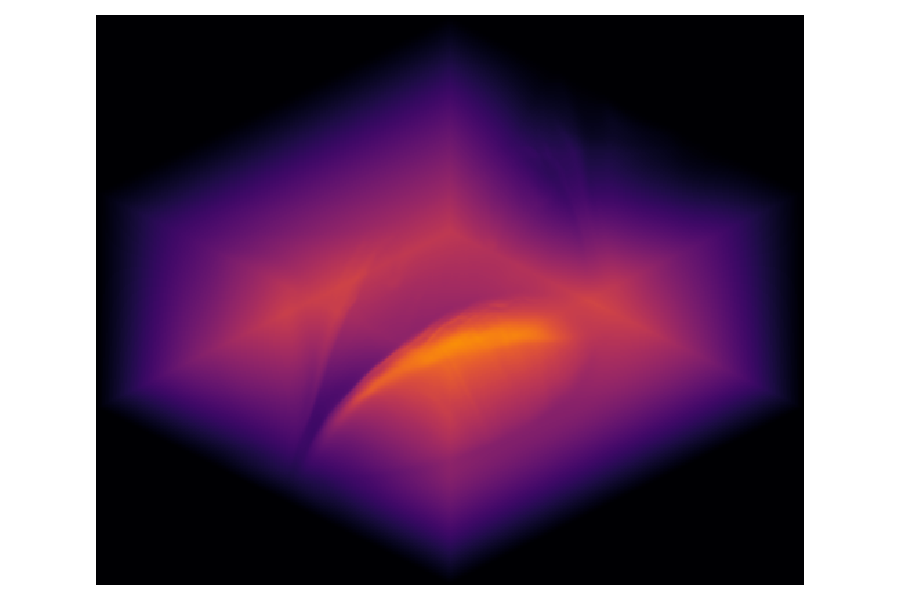

# simesh

**Scientific analysis directly on native AMR simulation data.**

Explore physical fields, trace magnetic structures, and produce synthetic
observations while preserving the simulation's original AMR hierarchy and cell
scales. Reusable Python interfaces connect the workflow; compiled Cython kernels
perform the numerical calculations.

[Get started](#install-and-run) · [User guide](docs/user/index.md) ·
[Examples](docs/user/index.md#examples) · [API reference](docs/user/api.md)

## Explore the mesh, structures, and observables

Three complementary views of the same simulated current sheet.

| Adaptive mesh | Current structure | Synthetic emission |
| :---: | :---: | :---: |
|  |  |  |
| 1,799 leaf blocks on the x = 0 plane | Current-density surface at the 99th percentile | AIA 171 Å · Oblique view · 1 MK |

<details>
<summary>Scientific context and figure provenance</summary>

These panels recombine earlier WENO509 exploratory results. The mesh colors
indicate refinement level. The current isosurface is extracted from a uniformly
sampled volume; the synthetic image assumes optically thin emission and a
prescribed temperature of 1 MK. Physical scaling is illustrative. These results
are separate from the quickstart teaching dataset.

[Figure provenance and rendering details](ASSETS.md#readme-showcase) record the
source products and display assumptions.

</details>

## What can you do with simesh?

- **Explore physical fields.** Sample points and slices, compute derivatives,
  and measure regional integrals and statistics.
  [MHD example →](examples/recovered_state_analysis.py)
- **Examine magnetic structures.** Trace field lines, calculate squashing factors
  and twist, and extract along-line profiles and current-based emission proxies.
  [Magnetic analysis →](examples/standard_applications.py)
- **Produce synthetic observations.** Integrate along lines of sight, synthesize
  EUV emission with optional absorption, and model radio free-free transfer.
  [Radiation example →](examples/radiation_bands.py)
- **Save and share results.** Retain reloadable analysis products, extract regional
  AMR snapshots, and export uniform volumes for VTK visualization.
  [Regional extraction →](examples/root_crop.py) · [VTK export →](examples/uniform_export.py)

A diagnostic map can guide seed selection; the resulting field lines can be
reused to sample other quantities. Fields and geometries carry across analysis
steps, with explicit numerical schemes, units, and physical models.

## Install and run

Requires **Python 3.11+** and a C compiler for the Cython extensions.
Install from source:

```bash
git clone https://github.com/Astery0502/simesh.git
cd simesh
python3.11 -m venv .venv
.venv/bin/python -m pip install -e .
.venv/bin/python examples/user_quickstart.py --output example-output/user-quickstart
```

The quickstart generates a small teaching snapshot, samples its magnetic field,
computes its mass, and saves and reloads a result. No simulation download is
needed.

<details>
<summary>Expected output</summary>

```text
Usable map samples: 64/64
Magnetic Bz: 0.001 T
Mass: 1e+06 kg; complete coverage: True
Result round trip: values and point IDs match
```

</details>

Choose a new output directory each time you run the example. Its physical scales
are synthetic teaching values. Optional `.[plot]` adds PNG rendering dependencies;
`.[fft]` adds FFT convolution support. See the
[build instructions](docs/dev/cython-build.md) for compiler and development setup.

## From a snapshot to a magnetic map

After running the quickstart, use its generated snapshot to sample a plane:

```python
import simesh as sm
from simesh import applications as app

with sm.open_amrvac("example-output/user-quickstart/snapshot.dat") as source:
    magnetic = sm.prepare(source, ("b1", "b2", "b3"), scheme="coordinate-phase")

# Plane geometry is in the snapshot's coordinate units.
plane = sm.Plane([0, 0, 0.5], [1, 0, 0], [0, 1, 0], (8, 8))
result = app.field_map(magnetic, plane, components="b3")
if not result.usable.all():
    raise RuntimeError("The requested map contains unusable samples")
sm.save_result("example-output/user-quickstart/bz-plane.result.npz", result)
```

`prepare()` supplies the neighboring values needed by the selected numerical
scheme. The resulting fields remain usable after the source is closed, and the
saved map retains its sampling geometry. For your own snapshot, select the field
names, geometry, preparation scheme, and physical scales appropriate to the
simulation. Continue with the [user guide](docs/user/index.md) to combine maps,
trajectories, regional measurements, and projected results.

## Supported data and numerical scope

- **Input:** AMRVAC v5 snapshots, including compatible AGILE outputs, and
  equivalent array sources on balanced, nonperiodic, three-dimensional Cartesian
  AMR meshes. Native analysis uses ordinary cell-centered fields.
- **Output:** reloadable maps, trajectories, profiles, and quantitative results;
  regional AMRVAC snapshots; and uniform-volume VTK products.
- **Current limits:** spherical and periodic native analysis, constrained-transport
  face-field analysis, and GPU execution are not supported. VTK export produces
  uniform volumes.

Physical scales and model assumptions must match the simulation. Results expose
coverage, validity, or tracing-termination information; check these before using
incomplete results for physical interpretation. The
[API reference](docs/user/api.md) documents each operation's requirements.

## Use with an AI assistant

The Python interfaces can be called from AI-assisted analysis workflows. Before
constructing a workflow, ask your assistant to run the version-specific offline
guide in the environment where simesh is installed:

```bash
python -m simesh.guide
```

The guide provides diagnostic choices and interface starting points. It is also
readable directly by users; package installation does not automatically load it
into an assistant. Review the selected units, numerical controls, and result
validity as you would for any analysis script.

## Development and license

See the [developer guide](docs/dev/index.md) for architecture and the
[build instructions](docs/dev/cython-build.md) for compilation, tests, and local
documentation builds. The [documentation map](docs/index.md) lists the available
guides; API descriptions are generated from source docstrings.

The active package, tests, and examples live in `src/`, `tests/`, and `examples/`.
[Archived implementations](legacy/README.md) are excluded from the build and are
not needed to use simesh.

`simesh` is licensed under [GPL-3.0-only](LICENSE).
[ASSETS.md](ASSETS.md) records algorithm provenance and third-party licensing.
