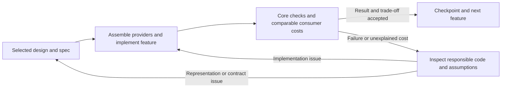

# Development Progression And Autonomous Work

This page owns how the next analysis core advances from design to useful software,
how research enters that work, and how decisions survive long runs and handoffs.
It implements the user's preference for design-led development with less routine
supervision. [Current](current-before-freeze.md) owns the actual active scope and next action.
This process document is not itself a request to launch an implementation or a
background job; later user instructions can activate and extend that scope.

Retain rewrite's useful habits: a concrete outcome, explicit data/ownership
boundaries, reusable references, short resume state and recoverable Git changes.
Do not inherit fixed group quotas, mandatory five-question audits, independent
review for every material change or a full regression suite at every checkpoint.
The user's current preference is direct inspection first, with focused tests and
measurements for core behavior and efficiency. Review ceremony is not acceptance
evidence.

The [intent](intent.md) is sufficiently developed to guide architecture. The
[shared spec](prepared-fields.md) and [result contracts](pipeline-results.md)
constrain implementation, but their open numerical/interface choices are not
all resolved. Complete the decisions needed for the selected delivery before
coding that delivery, rather than requiring every future application to be fully
specified first.

## Start And Resume

At the beginning of analysis-core work, read [current.md](current-before-freeze.md), inspect the
actual checkout/diff and follow the active decision's links. Read this workflow
when starting a stage or changing its scope. Consult intent/shared requirements
and the affected consumer, design or research record; do not reconstruct the whole
conversation or reread every historical rewrite document on every iteration.

The latest user instruction governs scope. A stale "documentation only" checkpoint
does not override a later explicit implementation request; update the checkpoint
when the instruction changes. Conversely, a roadmap or saved future preference
does not automatically authorize unattended execution of the whole roadmap.

Before an implementation run, record its concrete endpoint, selected checkout,
resource allowance and applicable acceptance. Recommend an isolated branch or
worktree, keeping canonical and rewrite implementations as comparison paths.
Ensure the selected design documents are present there: this repository currently
has substantial uncommitted documentation, which a checkout from HEAD alone may
omit. Preserve unrelated changes and fixtures. Local checkpoints include only
owned task work; no indiscriminate staging or cleanup of the user's working tree.

## Delivery Stages

P labels identify useful outcomes, not capability IDs or mandated package modules.
Maintain one active delivery at a time; required dependencies can be implemented
together when they form a coherent result.

The completion column describes outcomes to protect, not a requirement for a
separate test or review per item.

| Stage | Delivery | Decisions that must precede its implementation | Completion evidence |
| --- | --- | --- | --- |
| P0: assemble prerequisites and select the architecture | Explicit reusable I/O/geometry providers plus a concrete core design and resource/acceptance profile | Bind the existing providers through thin adapters; resolve relevant S1--S5, source versus compute identity, initial numerical strategy and executable location; consider E1 and E5 | Inspect provider contracts and trace the consumer geometries through the core. Check actual transfer/packing behavior only where assembly creates uncertainty; add a probe or review only for an unresolved core question |
| P1: usable native prepared data | A selected region/field set with actual valid ghost support and direct batch consumption | Data/slot mapping, transfer/support closure, validity, borrowing/publication, resident and bounded ownership, selected adapter scope | Exact selections/coverage, reference transfer results, coarse/fine and physical boundaries, derived remaining validity, slot reuse and complete costs; a native field product is itself a useful result |
| P2: first F result | Independent-seed tracing with terminal information and a defined simple accumulator, plus single-node parallel execution | Applicable F1, seed/result identity, finite error/termination criteria, miss handling, private worker state and output mode | Serial scientific reference and parallel conformance; short/long, coherent/divergent/interface cases; useful file-to-result time and total memory. Diagnostics-only is a valid initial mode |
| P3-D: whole-domain derivatives and slices | The requested global derived field calculation and specified slice consumption | D1, global coverage, derived ownership/delivery and later access, physical normalization | Global-plus-slice scientific accuracy, valid support, complete resident/bounded resources and matching real-data comparisons |
| P3-L: LOS synthesis | Full-domain image for a declared physical response and view | L1, units/EOS, per-pixel depth/weights, reconstruction and accumulation ownership | Analytic rays plus independent response verification, AMR coverage, orientation/depth cases, serial/parallel results and total costs |
| P3-F: selected Q/twist and along-line compositions | A named diagnostic with its actual derivative/auxiliary-state requirements | Diagnostic definition, Q method if applicable, error/quadrature and retained-result policy | Independent diagnostic accuracy and composed tracing/error/resource evidence; saved points alone do not certify coupled dynamics |
| P4: target-scale and supported-workflow integration | Declared large-data results and production integration for the selected scope | Available fixtures/hardware, compatibility and rollback/cutover conditions | Actual scale evidence plus affected public API, 2D/periodicity, I/O/helpers/build and migration gates; no closure inferred from kernel completion |

P1 must expose bounded storage and stable borrowing early; larger-than-RAM
throughput can be demonstrated later. P2 should establish parallel ownership
with its first useful tracer, rather than attach threading to a completed serial
cache as an afterthought. D, L and diagnostic deliveries have no dependency on
each other's complete implementations. Select the next ready consumer within
the agreed scope and intent priorities; do not impose the table's display order
as a false scientific dependency.

Recommended first unattended endpoint: P0 through P2, including applicable WENO
assessment. This bounds the first run by a usable result while protecting D/L
requirements. A user can instead authorize a broader endpoint; then intermediate
completion is a checkpoint and work continues without requesting renewed approval
at every stage. The actual endpoint is recorded in current.md.

## Design Entry And First Delivery

Start by assembling the available input/output and forest providers through the
[reuse boundary](data-organization.md#source-adapters-and-scope). The new core
should receive usable source data and be able to hand results to an existing
sink before it depends on new reader/writer implementations. Reuse rewrite's
block adapters and supported selective reader, and canonical file writing where
needed. Distinguish a memory block sink from complete `.dat` serialization.

This is P0's first work item, not another subsystem-development milestone. Inspect
the existing code/contracts and choose an explicit resident or bounded input mode.
If identity/layout conversion introduces a real integration question, use one
representative read/transfer/write check; do not recreate the old I/O test matrix.
Keep actual adapter overhead visible in later whole-workflow comparisons. Work
on new I/O only when a measured or functional limitation requires it.

The original-leaf [data organization](data-organization.md) is the concrete
baseline proposal. It is not automatically the final architecture. Before freezing
compute identity, resolve [E1 rebricking](algorithmic-directions.md#e1-rebrick-same-level-cells-for-analysis)
against that proposal. The source's physical cells and file leaves need stable
identity; the compute brick need not be the same object. A design may retain
original blocks initially, but must justify that choice and its mapping boundary.

Use the existing geometry, layout, halo and WENO findings to choose the initial
representation. A small geometry/support analysis may settle whether an alternative
is credible; an unrestricted implementation shootout is not the default design
method. Small F/D/L consumers validate the selected boundary and its promises;
complete implementations of all three are not prerequisites for P1.

The selected stage uses the existing [single design record](historical-index.md#how-a-decision-advances).
Keep detailed arrays and function contracts with that design; current.md stores
the active choice, links and completion state. Before numerical implementation,
name the reference arithmetic/transfer strategy and physical boundary interpretation.
Choose one explicit baseline rather than silently mixing whichever parts of the
two old implementations happen to pass a comparison.

## How Exploration Enters Development

The [E1--E5 route map](algorithmic-directions.md#route-map) is the retained research
queue. Consider its relevant entries at the owning decision, not as optional
reading that can be forgotten after the core is frozen:

- E1 is considered at P0 because it affects compute identity and halo volume.
- E5 informs P0/P1's preparation plan and compiled execution.
- E2/E3 enter when a declared reconstruction or geometry consumer justifies their
  different numerical meaning. They are not silent optimizations of the baseline.
- E4 enters a justified device/location stage with suitable resources; it is not
  a prerequisite for CPU/OpenMP delivery.

For each selected exploration, add only a short decision entry to its existing
design: the question, source/evidence, hypothesized benefit, numerical/ownership
impact, acceptance comparator, allowance, and retain/defer outcome with a concrete
reopen condition. Facts from papers, deductions for simesh, and simesh measurements
remain distinguishable. Use a few credible choices; do not introduce a framework
for every possible route.

Source evidence and mathematical reasoning can decide an architecture without
an experiment. When a probe is necessary, record its time/resource and variant
bound before running it. Keep one discretionary exploration active, with the
existing usable path available. A losing or inconclusive bounded exploration can
be deferred without user approval; do not lower acceptance to make it win or keep
retrying unchanged variants. A dependency required for the selected result must
instead be resolved or reported as blocking that result.

Promote a candidate when its affected behavior is explicit and the relevant
inspection, core checks and consumer measurements support it. Resolve any actual
findings; an independent review is not a default promotion gate. There is no
requirement to prove that every remaining idea is slower.
[Performance policy](performance.md#choose-the-smallest-useful-check) owns check
selection, regression and stopping rules; the inventory adds no test quota.

## Feature Completion And Feedback

The purpose of each core feature is better organization and consumption of native
field/ghost data. Before calling a substantive feature complete, check its actual
consumer behavior and compare relevant efficiency with the last usable version
and applicable canonical/rewrite paths. Use existing adequate evidence where it
still covers the changed work; new performance claims need actual measurements.
One useful composition can cover several helpers. This is not a per-helper test,
review or benchmark checklist.
Use the earliest usable consumer to check affected core behavior during
implementation. The feature-close comparison consolidates the result; it should
not postpone discovery of core errors until the end of the entire project.

Match the requested result, fields/reach/boundaries, precision, residency/cache
state and input/output work before interpreting a ratio. Review both the new
code and the relevant old/provider code when attribution points there. A reused
component is a replaceable provider, not exempt from inspection. A faster inner
kernel does not close the feature if preparation, copies or consumption erase
its benefit; a slower bounded path may still justify a declared memory trade-off.
[Performance policy](performance.md) owns metrics and regression limits.

| Finding | Next action | Where the conclusion belongs |
| --- | --- | --- |
| Comparators perform different work or use different preparation states | Correct the comparison or label its restricted/non-equivalent scope; do not infer a speedup | Existing evidence record and selected profile |
| Code violates an already clear requirement | Inspect field/region/slot binding, transfer, ownership or arithmetic at the responsible boundary; fix it and use the relevant focused check | Implementation and any necessary regression case; keep the valid spec |
| Correct result, but avoidable planning, I/O, copy, allocation or sampling cost | Inspect/profile the responsible new or reused layer; improve that layer or reconsider the execution choice | Selected design and affected E/T decision, with composed cost evidence |
| The representation or ownership contract prevents the intended consumer or makes its cost inherent | Record the counterexample and revise the data/view/lifetime boundary; select a credible alternative | Selected design and, if its observable guarantees change, [shared spec](prepared-fields.md) |
| Required scientific meaning or result coverage is missing, ambiguous or different | Resolve that meaning explicitly before comparing the revised strategy; obtain user input only where the existing autonomy rule requires it | [Consumer spec](pipeline-results.md) or shared spec, and affected [baseline](baseline.md) rows |

Reopening a spec records what assumption failed, the supporting evidence, the
changed guarantee and affected consumers. It does not retroactively turn a failed
case into a pass by relaxing tolerances, reducing requested coverage or dropping
valid support. A gain in F must retain the shared guarantees needed by D/L;
applicable impact can be established by reading their boundaries rather than
implementing every application or running a full matrix.

Keep a usable checkpoint while evaluating a replacement. If the candidate fails
or loses its intended trade-off, fix it, revert only its owned changes, or defer
it with a concrete reopen condition. Preserve the comparison and reason so a
later task does not repeat the same failed direction. Record the result, cause,
retain/fix/redesign/defer decision and next action in the existing design/evidence
and [current.md](current-before-freeze.md), without another approval packet. After rollback,
align active implementation/status with the restored version; keep undelivered
revised requirements explicitly open. Continue within the authorized endpoint
once the actual issue is resolved; optional independent
review is for a remaining concrete question, not every turn of this loop.

## Validation And The WENO Role

Choose evidence for the actual uncertainty. Direct code/header/contract reading
is enough for facts and simple wiring it establishes; do not turn such reading
into tests for metadata, internal sequences or every physical quantity. The
following evidence categories are used when the affected core behavior needs them,
not as three suites to run for every change:

| Evidence | Owns | Does not establish by itself |
| --- | --- | --- |
| Analytic/manufactured fields and focused invariants | Numerical meaning, refinement/boundary error, validity, ownership and failures | Real-data workflow speed or target-scale feasibility |
| Fixed WENO real-data cases with matched comparators | Complex AMR composition, selected/dense/support costs, cache/trace behavior and regression | Absolute physical truth, all diagnostics, 10--20 GB operation or million-seed scaling |
| Declared target-scale/resource cases | The actual input/output/worker envelope being claimed | Scientific accuracy without the corresponding numerical references |

The verified local specimen is `data/weno509_sub_0000.dat`, whose
[profile](../../../../rewrite/WENO-REFERENCE.md#fixture-contract) records 22,614 leaves
and levels 3--6. The spoken names "vino/weno-511" have not identified another
local fixture; do not silently rename this file or transfer its measurements to
a different snapshot. A later identified file gets its own recorded profile.

Use the relevant WENO real-data cases to close an applicable substantive delivery
or assess a core performance/behavior change within the recorded budget. For a new
product without a corresponding old implementation, add a named request and an
independent result reference; do not invent canonical tracer or LOS parity.
Keep full-halo controls for relevant changes and selected cases for local changes.
Do not turn the complete matrix into a per-edit, per-commit or ordinary test hook.

Freeze the request, field/reach/boundary meaning, compared revisions, budget,
equivalence classification and tolerance before each comparison. Existing one-layer
controls cannot certify the new two-layer preparation workload. Retain bridge
startup, source/field layout conversion, output copies, all live memory and cache
state in the declared comparison. WENO's original staggered record and the current
ordinary-field bridge keep their [adapter scope](data-organization.md#source-adapters-and-scope).

Use [performance.md](performance.md) for complete accounting and controlled
regression policy. These real-data cases are acceptance evidence, not optimization
targets to overfit. If a required fixture/resource is unavailable, record the gap
and continue independent ready work; do not claim that acceptance or the whole
delivery is complete. Reuse valid earlier evidence and run only checks affected
by the change. Documentation changes normally use direct reading and a diff check;
inspect affected links when navigation changes, without a new documentation test
suite or unrelated numerical runs.

## Autonomous Decisions And User Judgments

Once an implementation endpoint is authorized, the default is to continue through
ordinary implementation, fixes and checkpoints within that scope. The table
below distinguishes technical review from a missing user decision. Earlier
authorization persists; do not repeatedly ask for an action already covered.

| Decision/action | Default behavior |
| --- | --- |
| Internal layout details, batching, local refactors, tests and documentation within the selected contract | Decide and execute; record material rationale where it belongs |
| Local Git isolation/checkpoints and reversible experiment work within scope | Proceed while preserving unrelated changes, source fixtures and comparison paths |
| Builds, focused tests and selected benchmarks within the recorded allowance | Run as needed, inspect results, fix failures and continue; avoid repetitive suites without a new reason |
| New representation or numerical/ownership/failure change whose intended semantics are already authorized | Record the intended behavior and verify the actual core risk by reading and focused checks; request independent review only if a concrete important question remains |
| An unresolved choice of physical response/units, acceptable scientific error, loss of required output, or a change to the user's intended result | Seek the missing scientific/product judgment unless it has already been specified or delegated; continue independent work while waiting |
| More resources than the agreed allowance, new hardware/services, or replacement/removal of a supported public path outside the agreed endpoint | Obtain the missing scope/resource decision; do not infer it from a performance problem |

Default to a single agent's source/contract/diff inspection. Independent review
is optional when a specific unresolved core numerical, memory/concurrency or
architectural question would benefit from another perspective. State that question
and the expected value of review; layout changes, contract edits, stage completion
and code size are not automatic triggers. A reviewer does not replace meaningful
tests/measurements, supply the user's scientific preferences or authorize wider
scope. Resolve actual findings; do not create an artificial pending-review blocker
when direct evidence already settles the issue.

At run start, bind the endpoint, actual machine and controlled-memory/worker/
output/scratch limits. The endpoint can itself bound the run; record an additional
time or usage limit when the user supplies one. Bound discretionary experiments
separately. Safe operational details can use explicit conservative assumptions
within the task; ask only when the missing information changes the permitted
scope or meaningful resource/scientific acceptance. Record user-provided accuracy
targets or an explicitly delegated reference strategy. Do not manufacture a
physical accuracy target merely because a benchmark needs a number. Numerical
choices for later consumers can remain open until those consumers become active.

## Carry Decisions Forward

Use four existing kinds of record, each with one role:

| Record | Persistent responsibility |
| --- | --- |
| Intent, shared spec and consumer spec | Confirmed goals and observable guarantees; change definitions here, not in a chat recap |
| Selected design and E/T investigation record | Chosen mechanism, rejected/deferred alternatives, evidence and reopen conditions |
| Tests and compact evidence records | Executable protections and actual measured/scientific results |
| current.md | Active endpoint/stage, checkout, limits, evidence links, unresolved decisions and exact next action |

When new user steering arrives, identify the affected definition, update its
primary document and note the affected decision in the active record. Update an
executable protection only when core behavior changes and existing coverage does
not answer the resulting question. Changes such as optional trajectories or the
distinction between geometric access patterns
must thereby survive context loss; they should not live only in conversation.

At each useful checkpoint, refresh current.md rather than append a long diary.
Record what changed, what actually passed or failed, resource observations,
unresolved findings and the next concrete action. Link the exact commands/results
once available. Historical measurements stay historical. Compact evidence belongs
with the selected design; raw performance runs stay in the ignored results area.

Checkpoint before handoff, a potentially long operation or a resource limit, and
when a coherent delivery becomes complete. Continue to the next ready work inside
the authorized endpoint. Stop at that endpoint, explicit user direction, or an
impasse where no authorized independent work can advance; preserve a useful
resume state. Prefer completion-triggered waits for long processes; fallback
polling is no more frequent than 120 seconds unless a shorter interval is needed.
Saved process instructions describe continuation; they do not themselves schedule
or guarantee background execution.
