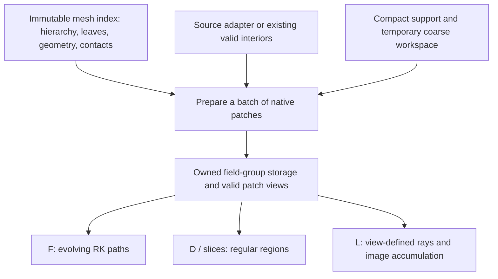

# Proposed Native AMR Data Organization

Status: concrete design recommendation, derived from the current requirements,
canonical/rewrite source and existing WENO evidence. This is the proposed initial
organization, not an implemented capability or a claim of measured new speed.
The [shared spec](prepared-fields.md) owns data meaning, validity and lifetime;
[consumer contracts](pipeline-results.md) own scientific results. This document
owns the recommended representation and the reasons for choosing it.

The recommendation is **one immutable mesh index, independently allocated field
groups, contiguous prepared patches on native leaf grids, compact support staging,
and batch transfer execution**. Full leaf blocks and temporary rectangular windows
use the same patch description. Applications keep their own traversal state.

Actual adoption and executable departures from this proposal are recorded in
[native-core-design.md](native-core-design.md) and [current.md](current.md).
This is the original-leaf baseline proposal for the
[P0 design decision](development.md#design-entry-and-first-delivery).
[E1 rebricking](algorithmic-directions.md#e1-rebrick-same-level-cells-for-analysis)
must be considered before adopting its compute identity; E5 informs preparation.
The other retained research routes have their own numerical and hardware scope.
None is silently adopted or rejected by the baseline representation below.

## Evidence Boundary

The repository fixture and reports use `data/weno509_sub_0000.dat`, not a file
named weno511: 1,045,232,320 bytes, 22,614 leaves, levels 3--6, and 8^3 cells per
leaf. The existing profile uses ordinary B fields from a non-staggered bridge;
the original record includes staggered tails. See the
[fixture contract](../../rewrite/WENO-REFERENCE.md#fixture-contract).

The source inspection below concerns canonical `src/simesh`, not legacy, and the
current rewrite mechanisms described by the reports. No numerical experiment or
benchmark was rerun for this proposal. Storage calculations below are arithmetic
from declared shapes, not measured performance. Existing reports retain their
numerical comparisons, revisions, setup costs and applicability limits.

## What The Two Implementations Establish

| Aspect | Canonical simesh | Rewrite | Design conclusion |
| --- | --- | --- | --- |
| Geometry/connectivity | Forest retains neighbor tables; mesh retains coordinates and spacing | Flat forest arrays are reusable, but RHE derives relations, support/slot bindings and phases for each selected chunk | Keep compact snapshot-level geometry/contact facts; separate them from field values and temporary slot bindings |
| Compute payload | Internal padded storage is `(leaf, x, y, z, field)`, with fields adjacent per cell | RHE/CHS storage is `(slot, field, x, y, z)`, with one field's spatial values contiguous | Both provide regular target-grid neighborhoods; axis order alone does not explain their measured difference |
| Allocation | Padded storage spans all leaves and loaded fields; refined work lazily allocates a full-leaf coarse array | Selected/support slots have bounded padded storage; CHS additionally retains completed owner blocks | Bound prepared values independently of global geometry; support-only data need not carry full padded allocations |
| Preparation | Bulk compiled passes over resident data and retained connectivity | Python control loops assemble/check actions and invoke compiled transfer kernels; RHC also has all-request preflight | Execute validated transfer batches using persistent geometric facts and bounded bindings |
| Repeated consumption | Direct access to resident prepared arrays | CHS avoids reads/fills on a hit, but still validates, locates, groups and plans cache access; misses complete one owner and copy its result into cache | Ready-data consumption should use direct compiled views; preparation should write into its final owned destination where feasible |
| Derived fields | Field-axis extension concatenates arrays and rebuilds/copies mesh storage | Local operators are explicit, but LFE output/delivery is narrow | Allocate derived field groups independently and publish their actual remaining validity |

Relevant source: [mesh allocation and bulk kernels](../../src/simesh/utils/lib/amr/mesh.pyx),
[forest tables](../../src/simesh/utils/lib/amr/forest.pxd),
[field-axis rebuilding](../../src/simesh/amrvac/amrvac_dataset.py),
[derived materialization](../../src/simesh/amrvac/derived_fields.py),
[RHE preparation/application](../../rewrite/src/simesh_rewrite/refined_halo.py),
[CHS allocation/hits/misses](../../rewrite/src/simesh_rewrite/completed_halo_sampling.py)
and [SLE stage orchestration](../../rewrite/src/simesh_rewrite/field_lines.py).
Canonical public block views transpose its internal layout; they should not be
mistaken for a separate mandatory resident copy of every interior field.

The following measurements are quoted only to ground the design inference:

| Existing observation | What it supports | Limit |
| --- | --- | --- |
| Full-domain width-two refresh: canonical median 0.309 s; RHC 38.202 s, with 23.345 s separate instrumented action preflight | Retain a direct bulk path; eliminate recurring structural work at its proper lifetime | RHC includes reads and output copies; canonical is resident. Nested attribution is not additive and this is not a pure kernel ratio |
| Same 512 target centers: resident linear grid query 0.084 ms; CHS warm point query 0.655 ms with no reads/fills | Ready-data addressing/orchestration remains a separate concern after halo work is eliminated | Regular-grid and general point-query control differ; CHS has one-layer preparation. This does not prove an array-order speedup |
| Thin ROI: 2.996 MB selected values, 116.048 MB reads at 57 slots | Represent actual output windows and support separately; full-block/all-direction work can amplify small requests | Required mathematics, file granularity and repeated loads all contribute; no claimed new saving factor |
| Eight-seed/eight-step warm trace: four CHS slots 694.62 ms, eight slots 3.757 ms | Working-set organization and retention can dominate the stepper | Narrow historical CPU-time control; no long-path or parallel scaling proof |

Sources: [full comparison](../../rewrite/evidence/M1-WENO-REFERENCE-COMPARISON.md)
and [thin-query assessment](../../rewrite/evidence/M1-WENO-ASSESSMENT.md).
The comparison runner had no OpenMP; application-warm does not mean controlled
cold disk. New architecture decisions can follow from these findings without
pretending that its speed or scientific acceptance has already been established.

## Recommended Representation



### 1. Immutable Mesh Index

Build/share this once for an unchanged analysis geometry. It contains no field
payload, RK state, image state or cache recency. Keep metadata-only file inspection
separate from constructing this analysis index.

| Array or table | Proposed information |
| --- | --- |
| Domain/block description | Active axes, physical bounds, root grid, interior cell counts and boundary/periodic geometry |
| Flat hierarchy | Roots, child-node arrays, node level/integer coordinates, node-to-leaf and leaf-to-node mappings |
| Leaf geometry | Stable zero-based int64 leaf IDs in SFC order, origin and level; spacing by level under one declared coordinate convention |
| Contact tables | Direction, SAME/COARSER/FINER/PHYSICAL relation, source IDs or finer-contact list, relative phase/subface and periodic image/physical-side information |

Retain all needed face/edge/corner contact information, while allowing a query to
select only the transfer directions it actually needs. For the currently modeled
balanced 2:1 Cartesian transfers, a compact representation can use
`contact_kind[N,26]` and `contact_ref[N,26]`, plus offset/count-based finer lists
with their subface codes. SAME/COARSER references identify a leaf; FINER references
identify a list; PHYSICAL references identify boundary geometry. Codes and source
IDs have distinct meanings. Active 2D uses its active directions. Wider/unbalanced
transfer support is not silently inferred from this profile.

With uint8 kinds and int64 references, those two base arrays use 5,291,676 bytes
on WENO. Finer lists, phase/boundary metadata, hierarchy and geometry are additional;
this is not a total-index bound. Metadata remains O(number of leaves/nodes) and
counts against the analysis budget. The recorded 18.80 ms canonical forest plus
connectivity construction supports considering retained geometry on this fixture,
not a universal startup-time guarantee.

Use geometry for point ownership, regular-region enumeration and ray traversal.
Keep source record offsets in the adapter: identical geometry in another file
does not establish identical offsets or values. Local coordinate arithmetic and
boundary ownership must retain the chosen numerical convention; precomputing a
reciprocal is not permission to change a strict division contract.

### 2. Independently Owned Field Groups

A field group fixes its field IDs/components, physical definitions, centering,
precision and numerical/boundary configuration for its lifetime. Examples are
B's three components, a scalar density, or a separately produced curl(B) vector.
Group fields that are consumed together; a request spanning groups receives their
views without concatenating every field into one growing mesh-wide column axis.

Recommend native float64 CPU payloads initially. Scalars and small vector groups
use the same element convention, with component count K. Allocate a new derived
group without moving B or rebuilding geometry. Each group owns its coverage and
remaining validity; grouping never makes a missing component valid.

For full-block storage, use fixed-capacity pages of prepared slots, with
`slot_of_leaf[N]` and `leaf_of_slot[capacity]` mappings for each active group.
The dense directory costs 8*N bytes per group, excluding other metadata, and
avoids Python hash lookup in a point kernel. Count it explicitly; do not create
directories for unrequested derived definitions. Page allocation keeps existing
buffer addresses stable when another page/group is added. Resident mode can use
direct SFC slot placement; bounded mode changes residency through the same mapping.

An interior already held in a prepared slot is the source for compatible support
reads. Do not require a second whole-domain raw copy alongside prepared data.
An optional raw-support retention area is distinct and budgeted; its value is
avoided reads, not merely a high hit rate.

### 3. Contiguous Native Patches

In this original-leaf baseline, the compute unit is a rectangular patch on one
leaf's local grid. It records leaf ID, logical interior window, target-grid
origin/spacing, buffer
offset/strides, field order, valid region and lifetime. A patch never merges
different AMR spacings into one apparent uniform grid.

Recommend component-adjacent C-order storage for the initial CPU representation:

```text
full-block page: values[slot, x, y, z, component]
prepared window: values[x, y, z, component] in a bounded scratch arena
G_i = interior_extent_i + lower_support_i + upper_support_i
```

Components are adjacent, then z, then y, then x. A scalar group has K=1. Inactive
2D z has extent one and no fictitious z halo; adapters preserve the public
singleton-z convention. For a page, the element offset is
`((((slot*Gx + i)*Gy + j)*Gz + k)*K + component)`.

This is a deliberate first layout: F and vector/response consumers can reuse
one location and interpolation weights across a small component group; scalar
groups retain contiguous spatial rows; block stencils still use simple fixed
offsets. It is not a conclusion that component-adjacent storage universally
beats field-major storage. Fieldwise SIMD or a future device kernel may favor
another layout. Keep conversions at explicit batch/backend boundaries, and use
concrete compiled kernels rather than a generic per-value accessor.

Use two preparation granularities with this same description:

- **Complete leaf patch:** the normal retained neighborhood for irregular paths,
  repeated use and dense block operations. It contains the full leaf interior
  and the required valid halo.
- **Rectangular window patch:** the scratch representation for a thin cut or
  local stencil request when a complete prepared leaf is unavailable/unhelpful.
  It contains the requested interior window plus actual dependency support.
  If a full prepared leaf already covers it, use a view instead of copying.

A window's support can come from its own leaf interior as well as other leaves.
It is never published as an entirely prepared leaf or entered under a full-leaf
cache key. Pools contain complete-leaf entries; temporary windows travel as an
explicit batch of descriptors and bounded packed storage. A returned/retained
window must own or pin its backing rather than borrow resettable scratch.

The [input support rule](prepared-fields.md#input-reach-and-remaining-validity)
applies: prepared primary inputs have at least two valid active-side layers,
with wider reach propagated when needed. A derivative output may allocate only
its actual one remaining layer. Per-field/per-patch valid boxes are separate from
allocation, and a planned window cannot be truncated to make it fit.

This keeps the frequently sampled neighborhood contiguous while giving regular
queries a way to avoid preparing an entire leaf. It also avoids making every
sample gather from separate face/edge/corner halo arrays. The thin-query evidence
justifies explicit window support; it does not promise a particular I/O saving.

### 4. Compact Support And Bounded Coarse Workspace

Distinguish prepared destinations from their source support. Sources that already
have resident interiors are borrowed under a declared read lifetime. Other
support values enter compact interior/read buffers, without automatically giving
every support-only leaf a complete padded slot.

Coarse reconstruction storage belongs to the active preparation batch/worker.
Construct the required restricted values and slope bases, share compatible
restricted work within the batch, then release it after its dependents finish.
There is no mandatory coarse array spanning every leaf. This moves storage
ownership; it does not change restriction, prolongation or physical-boundary math.
Reduced residency may trade storage for recomputation, so account for repeated
coarse work as well as saved bytes.

The reader receives exact logical field/region requests and can coalesce disk
reads within its declared contract. Reading a full compact interior can be
cheaper than many tiny reads. Logical support selection does not imply one-cell
physical I/O, and padding savings do not alone establish lower read volume.

### 5. Persistent Geometric Facts, Temporary Bindings, Compiled Transfers

Keep three different kinds of preparation information:

| Lifetime | Information |
| --- | --- |
| Snapshot geometry | Hierarchy, contacts, relative phases and geometric validity |
| Declared transfer profile | Small reusable region/arithmetic templates keyed by shape, support, relation/phase and numerical/boundary rules |
| Active batch | Requested destination windows, true source closure, source/destination slot bindings and temporary work dependencies |

Do not cache an unbounded list of per-cell actions for the whole snapshot. Use
compact numeric records and reusable templates. Rebinding a source slot is an
active-batch operation, not a reason to rediscover topology or reprove every
immutable shape fact. Conversely, retained geometry does not validate a newly
reused slot, a new coordinate or a changed field definition.

The preparation sequence is:

1. Enumerate missing destinations from the application's geometric request.
2. Close actual support, including indirect coarse slopes and physical bases;
   share overlaps between targets in the batch. A six-face shortcut is inadequate.
3. Reserve final destination storage and bounded support/coarse work under the
   complete budget. Reuse resident interiors and coalesce missing reads.
4. Bind source/destination views and validate the remaining dynamic obligations.
5. Execute dependency-ordered copy, restriction, reconstruction/prolongation and
   physical-fill batches in compiled loops. Complete prerequisite bases before
   dependent physical widening; preserve the declared arithmetic order.
6. Publish completed destinations and their exact validity. Prepared data can
   remain where it was produced, rather than requiring workspace-to-cache copies.

Historical RHC/CHS failure/preflight guarantees remain unchanged for their APIs.
A new preparation interface must specify its own validation/publication/failure
boundary before implementation. If whole-request preflight is required, perform
equivalent validation of the bound plan; do not discard the guarantee to gain
first-result latency. A failed preparation never publishes incomplete values as
ready. The source reader, numerical kernels and final output ownership stay explicit.

## How The Same Data Serves The Applications

| Consumer | Application-owned state | How it uses prepared patches |
| --- | --- | --- |
| F | Seed ID, position, RK/auxiliary state, owner hint, accumulators and optional trajectory output | Locate once where possible; use a leased complete-leaf view for valid samples; request missing neighborhoods in batches; preserve seed order and stage dependencies |
| D | Leaf/window selection, stencil output ranges and derived result ownership | Traverse known regular regions, prepare batches with shared support, write independent derived groups, then supply slices under the promised global/local coverage |
| Slice/profile | Plane/segment geometry and output samples/intersections | Enumerate intersected leaves, consume a covering prepared view or a supported window; reuse geometry when attributes change |
| L | Image tile/pixel, ray entry/exit/depth, current AMR crossing and image accumulator | Traverse declared global coverage using the mesh index; consume field patches for the ray's reconstruction, with physical path lengths and explicit accumulation ownership |

For L, recommend tile-owned rays as the initial work organization: it gives each
pixel a clear writer and keeps view/depth state independent of field storage.
Group required field neighborhoods within the active tile when useful. Account
for rereads across tiles and let compiled traversal avoid materializing every
ray-cell intersection for the full image. A later cell-driven accumulator can
use the same field storage; no speed or scientific equivalence is assumed.
Physical response, pixel averaging/reconstruction and quadrature still require
the [L result decisions](baseline.md#l1).

A whole-domain D request still computes the whole domain; a narrow slice cannot
silently replace it. Irregular F paths do not require storing the original field
as line-shaped arrays. L's global physical coverage does not require a global
uniform field volume. Different traversal state does not fragment shared field
meaning or ghost preparation.

## Residency, Publication And Parallel Ownership

Resident and bounded operation use the same geometric identities and patch
layout. In resident mode, keep the affordable selected group ready and run bulk
consumers without per-owner eviction/recency maintenance. In bounded mode, prepare
and consume admitted batches; retained complete leaves can be evicted only when
idle and not promised as a user-retained product. Retention/admission policy is
chosen outside the inner numerical loop.

Use a coordinator-owned preparation/publication phase and read-only consumption
phases initially. Active views hold their backing stable; workers have private
mutable RK/operator/ray scratch and disjoint outputs or a declared merge.
A consumer needing an unavailable patch returns a preparation request at a
defined continuation boundary. Resident work need not pause for artificial
cache misses; bounded F continuation must preserve partially evaluated RK state.
The exact work-batch size is a scheduling parameter, not the data format.

This gives an initial race-free ownership design without sharing the current
serial CHS object between threads. Misses, pinning, continuation and total worker
memory still need concrete function contracts; no Python callback or shared LRU
mutation is required for each sample. A serial execution uses the same ownership
rules. Requested field/trajectory/image products keep the shared spec's stronger
lifetime promise independently of internal cache eviction.

## Memory Consequences

For WENO's 8^3 interiors, three float64 fields and two active-side halo layers:

| Allocation | Arithmetic size |
| --- | ---: |
| All raw B interiors | 277,880,832 bytes |
| All B prepared blocks, 12^3 values per component | 937,847,808 bytes |
| Canonical full-leaf coarse storage, 8^3 per component | 277,880,832 bytes |
| Three derived components with one remaining layer, 10^3 per component | 542,736,000 bytes |

The full prepared block is 3.375 times its raw interior. Adding canonical coarse
storage makes those two allocations 4.375 times raw B, before metadata, derived
results, transient reads or outputs. Separating halo faces into other arrays
would not reduce the count of values if every same halo value remains retained.
The important controls are which patches/fields are prepared, whether duplicate
backing is necessary, and how long coarse/support work lives.

For one field group, the proposed live-value accounting is approximately

```text
8*K * (sum(allocated prepared patch volumes)
       + sum(distinct staged source volumes not already supplied by those patches)
       + simultaneous coarse/transfer scratch volumes)
```

Then add other field groups, mesh/index/directories, plans, worker state, retained
products and live outputs under [complete accounting](performance.md#complete-workflow-resources).
Aliased storage counts once; a temporary duplicate counts while both copies live.
No fixed percentage saving, RSS cap or new large-data speedup is claimed.

## Source Adapters And Scope

The first implementation assembles existing I/O and geometry components around
the new core. New data organization does not require rewriting those prerequisites.
Use a few explicit batch functions or existing descriptors as the boundary;
there is no need for a new abstract-class hierarchy or backend registry.

```text
existing file/index/forest and block reader
  -> thin identity/layout/lifetime adapter
  -> new field storage, compute patches, ghost preparation and consumption
  -> result/block sink adapter
  -> existing array backing or supported file writer
```

The active design work is the middle portion. The providers on either side are
reused within their real contracts and replaced only when a concrete limitation
affects the selected result.

### Existing Components To Assemble

| Need | Existing component | Boundary or limitation |
| --- | --- | --- |
| AMRVAC v5 index and file-order forest | `read_amrvac_v5_index` and `bind_amrvac_v5_forest` in [rewrite amrvac_dat.py](../../rewrite/src/simesh_rewrite/amrvac_dat.py) | Reuse metadata/flat forest and stable source leaf IDs; do not adopt an old executor just to obtain geometry |
| Selected native file reads | `make_amrvac_v5_block_reader` in [amrvac_dat_reader.py](../../rewrite/src/simesh_rewrite/amrvac_dat_reader.py) | Existing supported non-staggered v5 records; borrowed file descriptor; canonical field-first destination |
| Resident or memmap block input/output | `array_block_reader`, `array_block_writer`, `read_blocks_into`, `write_blocks_from` in [blockio.py](../../rewrite/src/simesh_rewrite/blockio.py) | Batch gather/scatter into explicitly owned backing; a block writer does not itself create an AMRVAC file |
| Original-file resident bootstrap | `get_metadata` and `read_blocks_sequential` in [canonical datio.py](../../src/simesh/amrvac/datio.py) | Can supply the recorded WENO ordinary fields; reads all leaves for selected fields, so count full input storage and startup |
| Complete supported AMRVAC output | `write_datfile_from_sfc` in [canonical datio.py](../../src/simesh/amrvac/datio.py) | Requires compatible SFC interiors and matching header/forest/tree; writes zero-ghost ordinary records, not arbitrary streamed analysis patches |
| Existing numerical rules | Standalone restriction/prolongation and other scoped rewrite kernels/references | Reuse compatible arithmetic without inheriting RHE/CHS orchestration; layout or support differences need an explicit adapter |

The [STO-003 contract](../../rewrite/contracts/STO-003.md) already expresses the
small block-transfer boundary. Its generic `BlockWriter` and the array/memmap
implementation are available; a native selective AMRVAC file writer is not
established by that descriptor. A new incremental file writer is a separate
extension only if a selected delivery needs it.

### Adapter Responsibilities

Resolve source leaf IDs versus compute-patch IDs, original file field IDs versus
loaded columns, region coordinates, dtype/layout and owned/borrowed lifetime at
the boundary. A source reader supplies actual interiors; ghost/support planning
and numerical transfers remain core responsibilities. Invoke I/O per batch,
outside cell, sampling and RK-stage hot loops.

Rewrite transfers require C-contiguous native float64 `(slot, field, x, y, z)`
buffers. If the selected compute representation uses component-adjacent storage,
use bounded staging and an explicit batch repack; a transposed view is not
automatically a valid destination for the old reader. Count both allocations
and the conversion, and avoid repeating it on every sample. The reader's layout
does not freeze the new core's internal layout.

For `.dat` output, map compute patches back to the selected output's source-cell
layout and supply matching tree metadata. Keep ordinary output headers consistent
with the records, including field count/names and `staggered=False`; do not copy
an original staggered header unchanged onto ordinary-only payloads. The existing
writer normalizes contiguous float64 input and may copy, so its complete logical
array and conversion costs are explicit. This adapter does not promise native
ghost serialization or arbitrary spatial-subset tree construction.

An assembled development driver may import existing rewrite providers through its
explicit development environment and pass them into the new core. Keep those
imports out of numerical kernels; a checkout-local rewrite namespace must not
silently become an undeclared dependency of the installed package. Extraction
into a shared installable layer or another explicit packaging choice belongs to
integration, not a prerequisite port of every rewrite component.

### WENO Input Choice

For an initial affordable resident run, use canonical ordinary-field reads and
wrap the resulting array as a block source. For the existing bounded native-read
comparison, use the recorded non-staggered bridge with DAT-003. Select the mode
explicitly: a resident fallback is not evidence of bounded original-file access,
and bridge creation remains part of fresh-start cost.

For routine WENO use, recommend a separately specified adapter that reads ordinary
cell-centered fields while correctly accounting for staggered record tails. It
could remove the reported 6--7 s bridge startup, but is a proposed format extension,
not an existing DAT-003 capability or support for staggered/CT computation.
Preserve the old reader's rejection and failure contract until that new adapter
is implemented under its own contract.

## Decisions This Proposal Makes

Recommend adopting the shared mesh index, independent field groups, component-
adjacent float64 CPU patch layout, full-leaf and explicit window preparation,
compact support staging, batch-local coarse work, compiled transfer batches and
stable read ownership as the initial design. These directly address identified
costs and geometric requirements; they do not depend on implementing every
application first or searching an unrestricted set of prototypes.

Exact numerical transfer/derivative strategies, F endpoint/Q contracts, L response,
available budgets and quantitative targets remain in [baseline](baseline.md#open-decisions).
Page capacity, batching and retention limits are tuning parameters within this
organization. Detailed compiled descriptors and public signatures follow this
design once adopted; existing capabilities remain intact.
Adoption includes the P0 decision on original leaves versus E1 analysis bricks;
the source leaf's identity need not permanently determine the compute unit.

The next development specification can now describe these arrays and their
preparation/consumption functions concretely. Subsequent checks establish
scientific conformance, ownership and real costs of the chosen organization;
they need not serve as a substitute for the architectural reasoning above.
