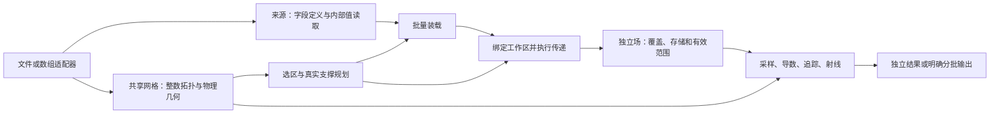

# 新一代 simesh：模块、接口与实现取舍

日期：2026-09-08。面向开发协作。

本页落实[已确认目标](next-generation.md)，是新一代的首版建设设计。
它定义选定边界、候选接口和实施顺序。N1–N4 已实现并验收，见
[N1](evidence/next-generation-n1.md)、[N2](evidence/next-generation-n2.md)、
[N3 证据](evidence/next-generation-n3.md)和
[N4 兼容交付](evidence/next-generation-n4.md)和[新包调用说明](../../analysis-core/README.md)。
[共享约定](prepared-fields.md)和[科学结果](pipeline-results.md)继续拥有科学含义；
旧版 `native-core-design.md`、公开 API 和性能证据是资产来源，不直接充当新架构。
以下源码路径省略 `src/simesh/` 前缀，均指向固定提交
`b91bbc015d882ffd7dfcd7e10590cdce559f8532`，不是当前主目录的旧源码。

## 1. 设计从何处改变

当前 `analysis/fields.py:FieldSource` 同时含 `fill`、`scratch_bytes`、
`strategy`、读取与 `plan_builder`，打开文件时会进入区域准备器的 `make_source`。
因此，即使只读原始字段，来源描述也已绑定鬼点算法、支撑容量和准备工作区。
新一代首先解除这个绑定：来源只提供数据及其解释；准备函数决定支撑与数值方法。

当前 `PreparedFields.halo` 同时用于数组内部区偏移和剩余有效范围；当前紧凑
重新分配的导数结果满足这个假设，但它不能直接表达更大 backing 中的有效窗口。
新场描述分别记录内部区位置与有效范围，先支持规则矩形范围，不建设逐单元有效性
框架。B 与 curl(B) 用独立同质场组表达不同有效性，不合并后重建全部列。

全域 `AMRMesh` 拥有几何、值、coarse、边界模式与交换索引。最新版本虽已释放
coarse 并修正 NumPy base 所有权，发布值仍由整个网格对象保活。新一代的目标
是几何、最终值和准备工作区分别拥有生命周期；外面包一层接口不算完成这一目标。

## 2. 公共模型与依赖方向



| 描述 | 拥有的内容 | 边界 |
| --- | --- | --- |
| `Mesh` | 全局整数拓扑、原始叶编号、物理域、块尺寸、层级/坐标以及定位所需只读数组 | 不保存字段、文件描述符、缓存槽或积分状态；额外邻接可按准备需求生成并复用 |
| `Source` | 共享 Mesh、完整字段目录、内部值批量读取、源寿命和已驻留输入 | 不拥有 `fill`、数值 scheme、准备工作区或池；文件打开仅准备必要索引/几何 |
| `Selection` | 所请求的区域、选定原始叶和明确的目标窗口 | 与额外支撑分开；不会把裁剪数组解释为新森林或新物理边界 |
| `Fields` | 字段定义、Mesh 引用、目标覆盖、存储映射、内部区偏移、有效范围、数值解释和最终值 backing | 原始、准备和派生结果共享此数据边界；每组字段具有相同布局/有效范围，添加另一组不改旧组 |
| 几何准备计划 | 目标、原始支撑叶、几何传递范围、阶段依赖和适用 scheme | 不保存数值、限制器结果、临时槽地址或工作者状态；普通一次准备无需保留整个全域计划 |
| 准备工作区 | 当前批次数值、源/目标绑定、coarse、可变限制器和临时数组 | 由一次调用或明确工作者拥有，完成后可释放；不得依靠它维持返回场的有效性 |

采用自由函数和少量数据描述，不建立 Dataset 式分析会话、统一执行器、任务图、
后端注册系统或字段表达式语言。来源的粗粒度批量读取回调可以保留；单元、RK
阶段和射线采样循环只接收已经绑定的数组及标量。

### 身份、布局与有效性

- 原始叶编号、计算块编号、当前存储位置分别命名。首版仍使用原始叶块计算，
  相同映射可以隐式表达，不为身份分离预先分配三套全域目录。
- Mesh 保留已有整数层级和坐标。E1 原型从浮点间距反推层级、坐标的做法仅是
  研究实现，生产映射应利用原始整数拓扑，不按舍入重建身份。
- 首版读取边界保留 `(leaf, component, x, y, z)`；准备场保留已验证的
  `(slot, x, y, z, component)` 连续 float64。明确一次装载/发布转换，禁止
  采样时转换全部场。重分块最终布局尚未采用，不能宣称现有内核已支持可变砖块。
- 内部区偏移与有效区分别记录。主场首版为内部值或两层有效 halo；导数消耗
  一层，留下的有效区继续传给消费者。超出已支持 reach 的请求明确拒绝。
- 普通区域入口选相交整叶块，返回实际扩大的覆盖并记录请求框；精确单元中心
  窗口是不同选择方式。支撑叶和 halo 不增加结果物理覆盖。
- 原始字段 ID 在来源内稳定，用户字段名在一次请求边界解析；结果保留所选顺序。
  数值内核只使用局部分量索引。单位标签、坐标单位和实际物理换算分别处理。
- 最终数组的真正 base/owner 保活底层分配，脱离 Source 后仍能消费。共享只读
  是调用契约；不宣称 Python/NumPy 别名不可被用户强行修改。
- 借用视图仅在声明作用域内有效，不冒充独立场。关闭源禁止后续读取；已发布
  独立场无需反复检查文件。分配成功或只读标志本身不证明计算已完成。

## 3. 模块职责与来源映射

新源代码根为 `analysis-core/src/simesh/`。下表确定职责归属，内部文件可随
实现规模拆分，不要求每行建立一套类。顶层 `simesh` 汇出常用自由函数。

| 新模块/责任 | 采用的最新资产 | 需要适配或重新组织的部分 |
| --- | --- | --- |
| `mesh.py`：共享拓扑、几何、选择、定位 | `analysis/mesh.py`、`_amr/forest.py`、几何/拓扑原语和 native 定位 | 合并对原始几何的公共解释，保留整数拓扑；不在每个字段源重建另一套消费者几何 |
| `io/`：文件/数组来源与输出适配 | `amrvac/_v5/`、`analysis_read.py`、`_amr/blockio.py` | 移出 `analysis_io` 对区域准备器的反向依赖；保留批量/选择读取、原始位、大小端、尾部和生命周期检查 |
| `fields.py`：物理定义及已发布场 | `analysis/fields.py` 的定义、字段顺序和独立寿命 | 分离存储位置与有效范围，Source 不绑定准备；避免兼容重导出造成的数据/准备/池导入环 |
| `preparation/`：选择、支撑、装载、数值执行、发布 | `analysis/_prepare/regional.py`、`analysis/geometry_plans.py`、`_amr/halo.py` 与支撑原语、`utils/lib/analysis/preparation.pyx` | 从闭包中拆出显式输入输出；几何计划与本次绑定分开，粗层旧编排逐项保留或改造 |
| `preparation/` 的全域实现 | `analysis/_prepare/resident.py`、`utils/lib/amr/mesh.pyx` 最新局部阶段和 `_prepare_analysis_mesh` | 抽取所需算术与阶段，把最终值分配从完整 AMRMesh 分离；不导入整个旧 Dataset/均匀网格系统 |
| `operators/`：采样、导数和独立派生场 | `analysis/sampling.py`、`derivatives.py`、native 导数与内联采样 | 将新场描述在批次入口绑定到连续内核视图；保留逐值算术、剩余有效性和不变量外移 |
| `tracing.py`：追踪、重追踪、沿线诊断 | `field_lines.py`、`diagnostics.py`、native 接受步状态机和定位提示 | 直接入口只消费 Fields；诊断可显式接收已算 curl，避免为接入复用而要求池或隐式重算 |
| `slices.py`、`projection.py`：切片、均匀输出和 LOS | `slices.py`、`los.py`、`thermal_rays.pyx` | 保留不同遍历/积分控制流、AMR 区间与流式输出；不强制通过统一点查询执行所有计算 |
| `physics/thermal.py`：热力学与响应 | `thermal.py`、历史 AIA171 表和已验证重构顺序 | 显式温度、EOS 和密度/长度换算；核心准备模块不理解仪器模型 |
| `bounded.py`：明确选择的有限容量流程 | `pool.py`、`value_cache.py`、file curl、F/LOS 缺失恢复 | 将池/读取恢复留在协调边界；普通直接消费者不根据对象类型暗中进入另一个执行器 |
| `_kernels/`：CPU 编译实现 | native、thermal rays、批量 preparation、`utils/lib/primitives/` 及选中 AMR 数值阶段 | 保留无 GIL、算术次序与原编译语义；按职责抽取，不沿用 `utils/lib` 作为新公共组织 |

空间/算术原语可先原样采用；已知耦合处必须有实际拆分。迁移表里的“采用”不
意味着全部函数原样进入新包，也不把改名计作优化。每次实现将实际采用的来源
与检查记录在本表对应责任下。

## 4. 数值方法与执行策略分开

两个已验证 scheme 在新一代首版都保留，完整身份沿用历史数值标识：

| 接口中的名称 | 数值标识 | 初始实现覆盖 |
| --- | --- | --- |
| `exact-phase` | `rewrite-ratio2-minmod-exactphase-cont-v1` | 区域、显式有界及全域分批；连续物理边界、两层主场 halo |
| `coordinate-phase` | `canonical-coordinatephase-cont-v2` | 快速全域驻留；连续物理边界、两层主场 halo；N2 修复 v1 的双物理边界支撑索引 |

新 `prepare` 首版要求显式 `scheme`。传入区域不会把 coordinate-phase 自动
替换为 exact-phase；该组合尚不支持就直接拒绝。更改 `workers`、批量大小
或文件传输策略也不能更改 scheme。这样可建设两个已有数值路径，同时将
“统一算术或选择全局默认”留作独立决策，避免未经科学/性能比较就自动选定。
这不是要求用户选择底层执行器；以后一个便捷入口可以绑定已经明确的科学配置。

全域/区域统一算术的候选是扩展 coordinate-phase 的区域准备，或让 exact-phase
具备竞争力的全域批量实现。现有跨方案比较不能证明可无声替换。本阶段不为
统一函数名重写算术，也不以缩小输出、改变精度或放宽误差作为效率改进。

线程池为默认 CPU 协调方式，默认一个工作者；支持的内核保留显式 OpenMP。
叶块局部阶段可以并行，跨目标写入阶段继续按原依赖和屏障执行。区域当前串行
是实现能力，四工作者是旧接口限制/本机验证范围，均不写成新一代的永久数学约束。
新入口验证正整数和执行能力；实施检查仍至多四工作者，不自动开启所有 CPU。

## 5. 用户接口草案

下列名称与签名描述完整目标中的组合关系。N1–N4 已实现的具体入口以新包 README
为准；示例中的 twist/curl_field、计划及 LOS 已交付，旧兼容迁移见已完成的 N4。
`memory_limit` 只在会分配/保留显著数据的操作入口出现，表示受控活跃数据
预算而非 RSS；本机实施例显式使用 2 GiB。初版不引入全局内存管理器。

```python
import simesh as sm

with sm.open_amrvac(path) as source:
    magnetic = sm.prepare(
        source,
        fields=("b1", "b2", "b3"),
        region=(lower, upper),
        scheme="exact-phase",
        memory_limit=2 * 1024**3,
    )

curl_b = sm.curl(magnetic, workers=4, memory_limit=2 * 1024**3)
section = sm.sample_plane(curl_b, plane, workers=4)
lines = sm.trace(magnetic, seeds, step=step, max_steps=1000, workers=4)
twisted = sm.trace(
    magnetic, seeds, step=step, max_steps=1000,
    twist=True, curl_field=curl_b, workers=4,
)
```

来源关闭后这些操作都只消费已有场。`curl_field` 要求匹配 Mesh、值生命周期、
分量含义、数值派生方式、覆盖与有效性；仅叶数或形状相同不够。省略它时一次
twist 请求可以明确计算临时 curl，重复请求则显式保留。无需通用依赖图或签名认证。

| 接口族 | 预期语义 |
| --- | --- |
| `open_amrvac(path)` / 数组来源适配 | 打开索引、解释物理字段与全局网格；不准备 halo，不绑定容量/缓存或选择数值 scheme |
| `read_fields(source, fields, region=...)` | 获取原始内部场；不为了访问单元值付出 ghost 成本 |
| `prepare(source, fields, region=..., scheme=...)` | 一次完成目标与真实支撑读取、准备和独立发布；不要求用户先把整个原始数组物化 |
| `plan_preparation(...)` / `prepare(..., plan=...)` | 同一几何重复准备的显式可选复用；计划兼容性包括目标、reach、scheme、边界和分区假设 |
| `sample` / `curl` / `derivative` | 输入 Fields，返回样本/独立场；声明分量、单位与有效性，不改变输入 |
| `trace` / `iter_traces` / `retrace` | 只读准备场，保存接受前缀与终止原因，轨迹可选；迭代结果明确拥有各批输出 |
| `sample_plane` / `iter_uniform` | 返回采样切片或独立 slab；采样图不宣称原生几何交面或像素面积平均 |
| `integrate_los` / 热 LOS | 全物理区间及像素结果/完成状态；热模型显式指定响应、温度和单位，保留两种重构次序 |
| `bounded` 中的迭代准备、追踪与全域导数流程 | 显式选择有限容量和输出方式；用相同内核恢复缺失，私有状态与所有者寿命留在协调层 |

不增加一套自动从 `.dat` 到所有科学产品的任务描述语言。一次性便利函数可以
组合上述操作，但不能引入不同结果定义。`curl(magnetic)` 计算已准备的目标
覆盖；只有完整目标覆盖或完成全部分批目标后才能称为全域 curl。

## 6. 探索在新设计中的位置

- **E1：保留原叶块作为第一条可用路径，同时保留真实映射边界。**已有证据
  证明合并机会充足，也证明稀疏扩张和先准备再打包的代价。新设计不重复几何
  可行性测量；直接砖边界准备与编译映射消费者成为以后是否采用的具体问题。
  首版 Fields 不把原叶编号当作永久存储地址，也不预建可变砖框架。
- **E5：计划属于准备模块，来源与最终场无需持有计划。**普通路径规划一批、
  执行一批；显式保留可共享几何，绑定数值与限制器每次重做。现有计划执行还
  使用独立 Python 动作序列，不能把新的直接 SAME/FINER 批量核收益归到它名下。
- **E2/E3：重构/交面拓扑改变时另设明确策略。**保留已有研究，不将基函数、
  dual mesh 或 gridlets 混入当前 trilinear/centered 的结果定义。
- **E4：设备定位边界保留在 Mesh 查询和显式 kernel 绑定。**CPU 数值语义
  不依赖 Cython 对象身份；不承诺当前数组或 Cython 源码可直接作为 GPU 布局。
- **T01–T18：按职责进入取舍。**T01/02 用于来源；T03/05/09/12/16 用于准备；
  T06/10/15/18 用于实际算子；T04/07/08/11 用于有界与输出；T13/14 等待阈值/
  原生几何消费需求；T17 约束布局转换。缓存命中量不替代完整成本，历史失败
  探索不因换了目录自动重启。

## 7. 独立构建与现有功能连续性

新包使用 `analysis-core/src/simesh/` 和目录内独立 `pyproject.toml` /
setuptools 构建入口。延续 Python 3.11、NumPy/Cython 和项目许可证；运行时
不得读取父目录源码、worktree、旧 `simesh` 或 `simesh_rewrite`。
最终导入名仍为 `simesh`，用独立虚拟环境/解释器比较两代，不能在同一个环境
靠调整 `sys.path` 同时混装，也不向当前主目录 `.venv` 覆盖安装新包。

构建只发现新目录内的源码，输出与清理都局限于该目录。编译 primitives 时保留
来源的检查/除法语义；新分析循环的优化/OpenMP 配置单独应用，不统一覆盖所有
扩展。源码构建产物必须能在无父源码路径的解释器中完成实际工作流。

旧 API 的连续性按能力登记：

| 现有能力 | 新一代处置 |
| --- | --- |
| 新分析的字段、F/D/L 与流式输出 | 纳入建设范围，迁移已有结果语义与策略，接口重新组织 |
| 原始块/元数据读取 | 来源适配器直接覆盖其已声明范围；更广旧格式/几何不可误报已覆盖 |
| mutable Dataset、命名派生注册、写回、数组建文件、VTK 导出 | 旧路径保留可用；随后逐项选择新适配或保留兼容实现，不要求分析核心依赖 Dataset |
| 旧 2D、周期和物理边界模式 | 保留原支持面；新分析首版不宣称继承，列为新代替换前的迁移缺口 |
| `simesh.tools` 独立数组工具 | 原函数可独立保留，不经 AMR 准备流程 |
| 历史原语和旧算法 | 作为独立数值比较器；已采用的生产依赖归入新目录并保持来源/许可证 |

全域 AMRMesh 可作为早期对照或隔离的临时适配器，但必须标记为未拆分资产，
不得凭这个适配器宣布新一代准备架构完成。旧 `uniform_grid_linear` 的隐式
OpenMP 边界写入问题仍有历史未解决证据，不能把它带入新采样默认路径。

## 8. 实施顺序与验收终点

| 阶段 | 可审查交付 | 验证重点 |
| --- | --- | --- |
| N0：本轮设计 | 模块/接口、采用资产、探索处置、构建隔离、遗留边界 | 源码与历史契约直接核对；不运行无变化的数值/性能矩阵 |
| N1：第一条独立可用路径 | 独立构建；文件/数组 Source；共享 Mesh；区域 exact-phase 准备与最小分批借用边界；采样、curl/切片与短追踪消费同一准备场 | 乱序字段/叶与真实跨级支撑、完整有效值、源关闭后独立场寿命及借用期内不覆盖、准备失败不发布；与固定来源同 scheme 比较完整区域流程 |
| N2：全域准备及所有权拆分 | 继承快速读取、coordinate-phase 局部阶段/线程池、独立最终 backing 与工作区；相同数据边界支持全域 | 全 padded 值与下游结果、逃逸数组寿命、无完整发布复制；全域文件→准备→curl/切片的完整成本 |
| N3：已有科学与执行资产完整接入 | 长追踪/twist、标量/热 LOS、可选几何计划、有界流程和大输出 | 相同种子/像素工作量、接受前缀、覆盖/顺序、单位与非线性次序；按改动复用现有证据，补完整组合比较 |
| N4：迁移交付 | 准确的新用户工作流、旧功能处置、独立安装与可回退路径 | 已承诺支持面的连续性；真实大输入等未完成能力继续显式记录 |

N1 的区域路径便于较小资源下验证新核心边界，不能据此代替 N2 的驻留效率目标。
各阶段是检查点；完成新核心不等于 Q、GPU 等所有长期候选已实现，也不能把
目前旧版支持的功能悄悄删除后声称完成替换。

实施沿用最多四计算工作者、2 GiB 受控活跃数组、2 GiB 新增临时磁盘及至少
2 GiB 可用磁盘的本机范围，运行前复核。单方案同范围逐值/误差检查在计时外；
分开首用、准备与复用，比较进程一次只加载一个版本。保留原样本和各来源，
不因单个内核更快省略文件到结果的成本，也不为未改公式创建专用测试。

N1 已完成 Source/准备分离、独立构建、存储/有效层分离和首条真实消费者组合。
新原始/准备/派生组当前用 `storage_halo` 与 `valid_halo` 表达对称矩形支持，
没有宣称任意逐块非对称布局。数值 scheme 仍须显式选择，N1 只执行 exact-phase。
N2 已完成全域 coordinate-phase、最终 backing 所有权拆分与完整驻留成本验收。
N3 已完成科学、计划、有界流程和大输出验收；N4 已完成选定旧公开功能的兼容交付。

### N4 实施选择

保留自包含 `simesh.amrvac` 及其必要的 `utils.lib.amr` 兼容实现，维持 mutable
Dataset、命名派生/导数、读写、建文件、2D singleton-z 和 VTK 的公开行为。
数组工具 `simesh.tools` 与 `utils.configurations` 独立保留。只导入原生核心
不加载兼容 AMR；旧对象和所有权不进入新 Source 或 Fields。

`source_from_dataset` 从已加载列复制内部值并构造独立整数几何；
`write_amrvac` 验证完整覆盖与显式元数据，按原始叶顺序打包一次交给既有
serializer，并在临时文件完成后发布。这里允许清楚计入的边界副本，不通过
把旧可变对象伪装成不可变场来回避成本。格式无法保存的单位/scheme/派生身份
不冒充 restart 物理状态。

compatibility AMR 普通串行编译，保留原数值指令并应用 N2 已知 prolong 修正；
新原生 OpenMP 配置独立。周期文件元数据保留，周期 ghost 与无 CT 载荷却带
staggered 标记的写入明确拒绝。VTK 仍保持原有端点坐标约定并在迁移文档说明，
没有把它静默换成原生采样中心。公开选择与限制以新包 MIGRATION.md 为准。

### N3 实施选择

普通追踪和 LOS 只接收 Fields；明确的 `bounded` 入口借用准备池，保留 RK/射线
状态并恢复缺失块。两者共享实际数值状态和图像分块函数，没有建立统一任务图。
curl 用来源、字段顺序及定义、分量和 scheme 的小型逻辑身份确认可复用性，
不通过引用输入值来证明派生关系，主场数组可以独立释放。

E5 计划仅持有 Mesh 和几何动作，数值与限制器每次绑定重算。可选内部值缓存
借用 Source；关闭后释放 backing，父源关闭也禁止命中读取。独立文件任务各自
打开 Source，输出完成后才发布，并在返回前等待全部工作者退出。

热场转换按字段组绑定存储偏移和有效窗口；不在每叶循环重复公共窗口校验。
保留响应公式与两种重构次序。百万种子和实际 1000³ 输出采用拥有结果的分批
交付，不保留完整体积；这项输出规模证据不等于真实 10–20 GB 输入验收。

### N2 实施选择与发现

全域坐标方案从共享整数森林直接构造所需邻接与坐标数组。数值函数临时绑定
NumPy 的最终值与独立 coarse 缓冲，保留局部阶段并行和跨目标传递顺序。
原始内部值在装入最终数组后释放，再分配 coarse；发布无完整复制，不让返回值
持有交换对象、旧森林对象或准备几何。现阶段专用邻接可随一次准备释放；
是否显式保留由后续重复准备的实际成本决定，不新增自动缓存。

源码和小场对照确认一项原实现缺陷：粗块若横跨某轴两侧物理边界，`idphyb=2`
会访问 prolong 支撑表的第 4 行，但旧表只有 3 行。在 `(2,1,1)` 根布局的
9 叶混合级别常量场中，固定来源和初始原文抽取均产生 3456 个错误零值，
而邻接、坐标完全一致。新实现扩展支撑表并同时应用两侧扩宽；修正后全部值为 1。
旧生产代码保持原样供对照。该修正落实常量保持和两层有效支撑要求，不采用
另一种重构；为明确区别已知错误行为，新代标识为 `canonical-coordinatephase-cont-v2`。
不触发该条件的旧方案算术继续逐值比较，触发条件的案例使用独立科学参考。

另在几何边界预检 coordinate prolongation 的粗网格索引和两侧斜率支撑。
例如大坐标原点导致 fine halo 中心舍入到 coarse 最后一个单元时，旧无检查
插值会越界读取；新实现明确拒绝不能表示的模板，不切换方案或读取无效值。

全域物理存储保留原始 SFC 顺序。若调用者指定全域叶的另一顺序，Selection
保留该顺序，slot 目录负责寻址，避免为了重排再复制全场；直接 `interior()`
只适用于打包顺序，其他情况用窗口访问或明确物化。局部 coordinate-phase
仍拒绝，不自动扩大到全域。N2 的验收状态以 current.md 和阶段证据为准。
