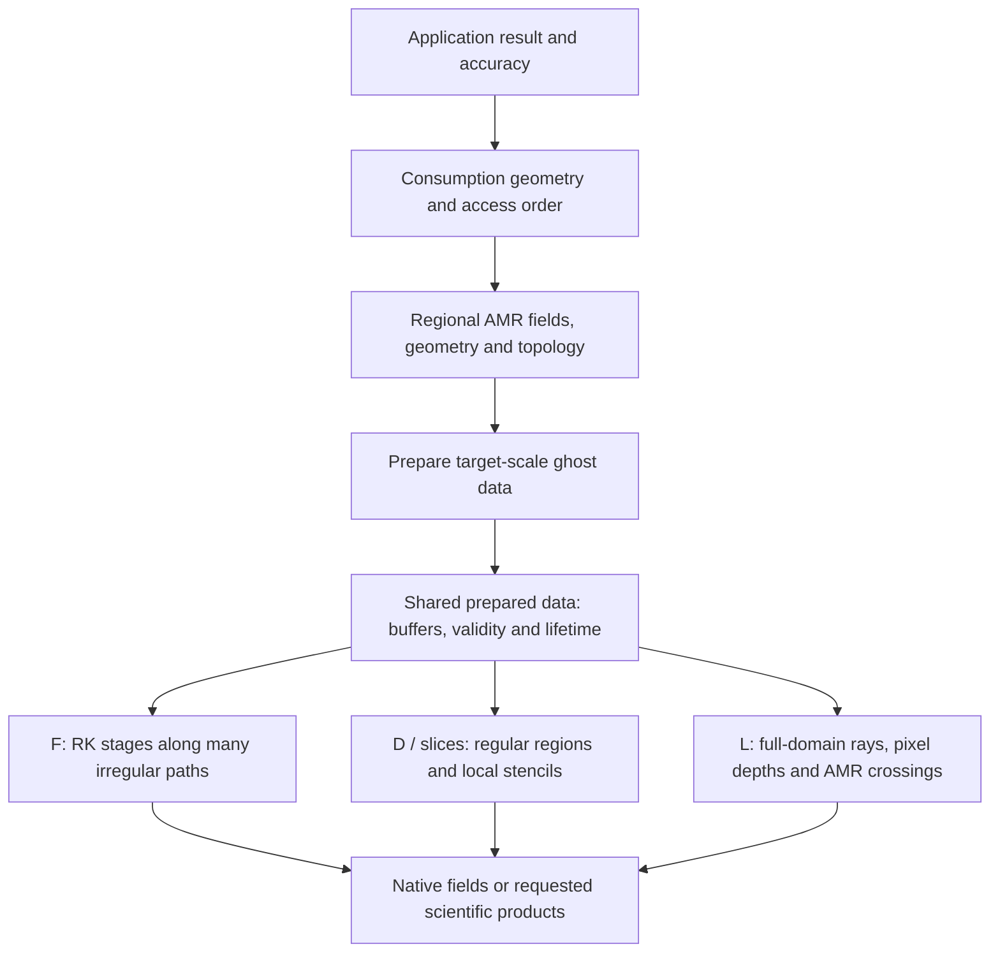

# Analysis Core: Intent And Specification

This directory defines the next scientific analysis core. Start from application
results, derive the required native AMR data and support, then specify how that
data is prepared, held in memory and consumed. Canonical simesh, rewrite and
external work supply evidence; their layouts and milestone order do not choose
the new architecture.

## Organizing Model

The mainlines share ghost-prepared AMR data. Their geometric demand, access order
and reuse determine how that data should be organized and supplied. The arrows
describe dependencies, not a universal executor. Interior fields remain available
as direct products or inputs to operations whose declared stencil needs no halo.
The same data meanings support task-scoped work and retained exploration.

## Reading Path And Document Ownership

Read the first five documents in order; consult the remaining references only
for the question being designed. Each subject has one primary definition.
For ongoing development, start with [current.md](current-before-freeze.md), then the selected
stage in [development.md](development.md) and its linked design/spec. This is a
short resume path, not a requirement to reread the entire catalog.

| Role | Document | Owns |
| --- | --- | --- |
| Intent | [intent.md](intent.md) | Goals, priorities, operating scale, scope and durable engineering constraints |
| Shared spec | [prepared-fields.md](prepared-fields.md) | Consumption geometry, selection, field meaning, support, block views, ownership, reuse and parallel boundaries |
| Consumer spec | [pipeline-results.md](pipeline-results.md) | F/D/L scientific results, application-specific dependencies and acceptance |
| Design recommendation | [data-organization.md](data-organization.md) | Concrete memory organization, preparation and access design derived from canonical/rewrite evidence |
| Selected implementation | [native-core-design.md](native-core-design.md) | Adopted numerical/layout/ownership choices, bounded explorations and current executable evidence |
| Convergence | [baseline.md](baseline.md) | Open decisions, requirement-to-evidence map, existing-asset roles and readiness |
| Application reference | [workflows.md](workflows.md) | U01--U12 lookup and detailed products beyond the three mainlines |
| Investigation reference | [technique-candidates.md](technique-candidates.md) | T01--T18 mechanisms, source evidence, conditional benefits and limits |
| Algorithmic research | [algorithmic-directions.md](algorithmic-directions.md) | E1--E5 rebricking, reconstruction/ABR, dual mesh/gridlets, RT location and fill-plan routes, with numerical impact and entry conditions |
| Composition reference | [lifetime-sketches.md](lifetime-sketches.md) | Concrete usage sequences and optional execution trade-offs |
| Validation reference | [performance.md](performance.md) | Scientific evidence, comparable costs, complete resource accounting and regression policy |
| Development | [development.md](development.md) | Design-led stages, exploration promotion, autonomous work and decision persistence |
| Active state | [current.md](current-before-freeze.md) | Current scope, selected stage, checkout/resources, evidence and next action |
| Editorial record | [reorganization.md](reorganization.md) | Content migration, preserved distinctions and superseded discussion |

## Status Vocabulary

- **Confirmed:** an agreed goal or constraint. This does not claim delivery.
- **Specified:** an observable obligation in the shared or consumer spec; exact
  interfaces and numerical choices can remain open where identified.
- **Evidence / measured / present:** a source or historical run establishes only
  the stated behavior in its named scope. It does not select the new design.
- **Candidate:** a possible mechanism, composition or future feature.
- **Open:** a decision still needed, tracked in [baseline](baseline.md#open-decisions).

Existing [rewrite contracts](../../../../../previous/rewrite/contracts/README.md),
[capabilities](../../../../../previous/rewrite/CAPABILITIES.md),
[migration ledger](../../../../../previous/rewrite/SOURCE_MIGRATION.md) and
[WENO profile](../../../../../previous/rewrite/WENO-REFERENCE.md) retain authority for their own
implementations and claims. New goals do not retroactively change them.

## Current Checkpoint

The confirmed next-generation scope is independent development under the
repository-root `analysis-core/`, incorporating the latest accepted worktree
implementations and the exploration assets. The
[scope and pinned source inventory](next-generation.md) records this direction;
earlier limits to extending `simesh.analysis` describe the previous delivery.
The [next-generation design](next-generation-design.md) maps module boundaries,
candidate interfaces, asset reuse and the first implementation checkpoints.
The independent N1–N4 runtime profiles are delivered: explicit sources,
regional and whole-domain preparation, detached ownership, scientific consumers,
optional geometry plans and bounded or streamed output.
See [package usage](../../../../../../README.md), [N1 evidence](evidence/next-generation-n1.md)
[N2 evidence](evidence/next-generation-n2.md), [N3 evidence](evidence/next-generation-n3.md)
and [N4 evidence](evidence/next-generation-n4.md). Stateful Dataset, ordinary
writing, export and array-tool continuity are bundled in a separate compatibility
layer; see the [migration guide](../../../../../../MIGRATION.md).

The previous efficiency consolidation was organized by computational stage and
complete consumer cost. Its [review and long-task plan](efficiency-consolidation.md)
(Chinese, for development collaboration) records module boundaries, retained
algorithms, parallel ownership questions and the WENO509 acceptance plan.

The actual scope, completion state and next action have one owner:
[current.md](current-before-freeze.md). The delivered P0--P4 baseline and subsequent authorized rounds share this record. Its
[selected design](native-core-design.md) records provider assembly, E1--E5
dispositions, preparation/consumption choices and linked executable evidence.
Consult the checkpoint for delivered versus still-unverified scope; the
original proposal and historical rewrite milestones do not override it.
[Baseline](baseline.md#open-decisions) retains the decision inventory.

## How A Decision Advances

Use one short consumer-driven design record: requested result; affected R rows;
owned decisions; input/output, validity and lifetime; a few credible choices;
decision-changing uncertainty; and scientific/resource acceptance evidence.
Link to definitions here instead of copying them. Reuse existing source and
measurements; propose a bounded experiment only when it could change a choice.

Use [development.md](development.md) for stage entry, optional independent review,
exploration promotion and autonomous continuation. The current user instruction
and [active record](current-before-freeze.md) determine the implementation endpoint; a historical
milestone queue or completion of every application is not an entry condition.
At substantive feature completion, the
[feedback loop](development.md#feature-completion-and-feedback) connects comparable
consumer costs to code inspection, retained/rolled-back choices and spec revision.

For documentation, check preserved requirements, status, links and diffs.
Numerical/build suites are unnecessary for prose alone. For implementation,
validate the immediate user result and affected protections with proportional
checks and the [performance policy](performance.md).
