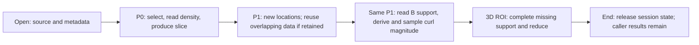
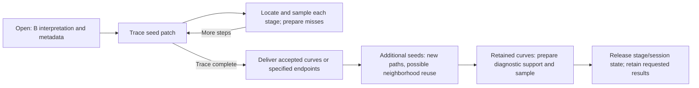
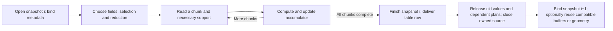

# Composition Reference: Usage Sequences

Status: candidate organizations, not selected execution modes or a separate
lifecycle research stage. [Prepared fields](prepared-fields.md) owns shared
validity, ownership and retention; [F/D/L](pipeline-results.md) owns the current
mainline results. These examples test how geometric access and repetition affect
data organization. Sequence C is an adjacent scan example, not a substitute for L.

## Working Hypothesis And Evidence Boundary

An unchanged snapshot can supply several queries with shared interpretation and
useful prepared state. A task can be short-lived or retained; resident and bounded
storage are choices within either lifetime. Existing mechanism limits are in
[baseline](baseline.md#existing-work-contract-and-implementation-disposition):
CHS is serial and specialized, RHC views are call-scoped, LFE allocates full
selected blocks, and canonical field additions can copy/rebuild arrays. These
combinations have not been implemented or benchmarked.

## Draft Lifetime Constraints

The former draft constraints have been consolidated into
[product ownership](prepared-fields.md#explicit-retention-versus-internal-caching),
[reuse/invalidation](prepared-fields.md#reuse-and-invalidation) and
[resource/parallel requirements](prepared-fields.md#resources-and-parallel-ownership).
No additional lifecycle framework is required by the examples.

## Cost Vocabulary For Comparing Sketches

Use the [complete resource definition](performance.md#complete-workflow-resources)
and compare the whole sequence: opening, preparation, queries, delivery and
conversion/switching. A warm query does not erase first-use work. Qualitative
costs are sufficient until a concrete decision needs measurements. The examples
below name potential savings and their costs, not measured rankings.

## Sequence A: Moving Slices And A Regional Statistic

Concrete sequence: open a snapshot; obtain density on plane P0; move to P1;
color P1 by the magnitude of curl(B); then integrate that quantity over a chosen
3D ROI around the feature. Density and B are separate input sets. The ROI
integral uses native cell volumes under a defined rule, not a sum of image
pixels. This curl-magnitude volume integral is a proposed consumer beyond LFE's
current unweighted single-component sum. Whether the slice means point samples
or cell intersections is still
an output-specification question. This sequence covers U01/U02/U04/U08.

| Transition | Created or computed | Potentially reused | Invalidated, released or still live |
| --- | --- | --- | --- |
| Open -> P0 | Query geometry, density reads, slice result | Snapshot metadata | Chunk buffers reusable after consumption; result remains if caller keeps it |
| P0 -> P1 | New intersections/sample locations and missing reads | Metadata and overlapping density neighborhoods | P0 location plan is not P1's plan; old image may remain caller-owned |
| P1 density -> curl coloring | B reads, required halos, derivatives and samples | P1 geometry/location where its conventions match | Density need not remain; B/derivatives may be retained only if useful and affordable |
| Slice -> 3D ROI integral | ROI windows, missing B support and volume-weighted reduction | Compatible B/halo/derived coverage | Slice samples cannot supply the volume; query scratch expires after reduction |
| Session end | No new computation | Detached images/statistic retained by caller | Release session-owned storage; borrowed source remains its owner's responsibility |

| Sketch | Lifetime choice and candidate mechanisms | Expected advantage | Cost or weakness |
| --- | --- | --- | --- |
| A1: query-local payload | Share metadata; each query reads/prepares its own data, consumes it and releases scratch; T01/T04/T05/T11 | Low retained memory and simple query boundaries | Overlap rereads and repeated support/check work; no automatic warm benefit |
| A2: bounded retained neighborhoods | Retain useful raw/halo/derived coverage and possibly P1 geometry between queries; T05/T08/T09/T12 | Nearby moves or repeated coloring may avoid expensive preparation | Cache bookkeeping, coverage checking, copies and eviction; geometry/derived caches are not currently delivered |
| A3: resident selected fields | Load required fields and prepare affordable dense support once; T02/T03/T10 | Many or dense queries can share bulk preparation | Initial read/storage cost; adding B or derivatives can create a large transient peak; eager fields may never be used |

**Provisional judgment:** A1 is a useful low-retention comparison; A2 needs
actual overlap/repetition; A3 is credible when the complete footprint fits and
enough queries follow. No universal selection follows from file size alone.
The existing [thin-query evidence](../../../../../previous/rewrite/evidence/M1-WENO-ASSESSMENT.md) warns that
small outputs can still require amplified support. Canonical field-axis changes
can copy/rebuild mesh storage, so "add one displayed field" is not assumed cheap.

**Decision-changing unknown:** after moving the plane or changing the field,
how much compatible prepared data is actually reused? A later narrow comparison
can track read/halo/derivative work and peak live buffers for this sequence;
surface-quality or ROI-integral semantics must be fixed before that comparison.

## Sequence B: Field Lines, More Seeds And Diagnostics

Concrete sequence: open B; trace a seed patch; add nearby seeds; then evaluate
a named derived diagnostic along retained curves. Include a divergent seed
variant and an endpoint-only request. A diagnostic on saved points and a jointly
integrated diagnostic have different sampling/quadrature requirements. This
sequence covers U03 and its U01/U02 dependencies. It explicitly chooses retained
curves; the [F contract](pipeline-results.md#retention-and-acceptance) also permits
diagnostics-only delivery and user-selected retracing.

| Transition | Created or computed | Potentially reused | Lifetime constraint |
| --- | --- | --- | --- |
| Open -> first trace | Stage arrays, locations, B neighborhoods, result storage | Metadata and previously prepared B if supplied | Caller output storage already counts at its allocation, not only as points become accepted |
| Stage -> next stage | New coordinates, RHS and step arithmetic | Last-owner hints, completed B neighborhoods, stage buffers | Hints require containment checks; buffers remain live until the stage consumer finishes |
| First seeds -> more seeds | New paths and possibly additional output arrays | B neighborhoods and source interpretation | Nearby seeds may diverge; finished paths are results, not substitutes for tracing new seeds |
| Curves -> derived diagnostic | Dependency fields/halos, derivative work and diagnostic samples/integrals | Saved coordinates and compatible B preparation | Current CHS is a three-field session, not a general derived cache; saved points may be insufficient for a requested quadrature |
| Close | Release scratch and retained preparation | Detached requested curves/endpoints/diagnostics | Source handle ownership remains explicit; endpoint-only/segmented output needs a new contract |

| Sketch | Lifetime choice and candidate mechanisms | Expected advantage | Cost or weakness |
| --- | --- | --- | --- |
| B1: bounded stage batches without persistent payload | Prepare each batch and discard payload; T04/T06/T15 | Simple bounded preparation and no retained cache policy | Consecutive stages/seeds may repeat nearly identical reads and halos |
| B2: retained completed neighborhoods | Existing CHS-like B reuse, hints and stage batching; possible separate diagnostic preparation; T06/T07/T09/T15 | A fitting working set can eliminate repeated expensive B preparation | Miss/thrash cost, dynamic checks and output growth remain; raw/derived extensions require design |
| B3: resident tracing fields | Prepare B and the affordable requested diagnostic fields before dense repeated sampling; T03/T10/T15 | Low warm sampling cost when many paths cover much of the domain | Large initial/retained footprint; speculative diagnostic preparation may be wasted |

**Provisional judgment:** B2 has a useful existing foothold; it is not evidence
that every trajectory workload favors completed-halo caching. The
[WENO comparison](../../../../../previous/rewrite/evidence/M1-WENO-REFERENCE-COMPARISON.md) shows a cache
capacity knee and much cheaper resident warm sampling, with different preparation
costs. Its short traces do not establish long-path or many-seed behavior.
Diagnostic preparation must not evict active B inputs; budgets for B, diagnostic
workspace and caller-held curves must be considered together.

**Decision-changing unknown:** is the limiting cost repeated owner preparation,
warm per-stage overhead, or retained/output memory? Only the relevant question
needs a later probe. Adaptive stepping, exact events, seed reordering and
parallelism remain separate choices with their own numerical and lifetime cost.

## Sequence C: Large Snapshot Scans And A Small Table

Concrete sequence: read the fields needed for a regional/global statistic,
accumulate a table row, discard snapshot values, and process the next snapshot.
Compare a pointwise quantity with a derivative-based one so halo needs are not
assumed universal. Define cell/volume weighting and reduction order. This is
U08/U10; it intentionally has little payload reuse across snapshots.

| Transition | Created or computed | Potentially reused | Invalidated or released |
| --- | --- | --- | --- |
| Open -> scan | Source interpretation, selection, accumulator, workspace | Caller-supplied compatible geometry only after establishing its validity | No need to populate a persistent field cache merely for one pass |
| Chunk -> next chunk | New payload/support and reduction contribution | Scratch allocation, accumulator, worthwhile overlapping support | Previous payload validity ends as slots are overwritten |
| Last chunk -> row | Complete statistic and completion information | Small table state | Large field and query state can be released; a table is streamed if the series itself becomes large |
| Snapshot i -> i+1 | New source binding/offsets and changed values | Allocation capacity; geometry only with explicit compatibility | Old raw/halo/derived values and value summaries expire; same leaf count is insufficient for geometry reuse |

| Sketch | Lifetime choice and candidate mechanisms | Expected advantage | Cost or weakness |
| --- | --- | --- | --- |
| C1: streaming field chunks | Retain reduction and reusable scratch, normally discard payload; T02/T04/T10/T11 | Small field working set and no compulsory cache population | Support overlap, chunk scheduling, reduction-order constraints and sink cost |
| C2: selected fields resident per snapshot | Prepare current snapshot once, share several statistics, release before next; T03/T10/T11 | Amortizes preparation across sufficiently many statistics | Feasible only with complete resident footprint; provides little value for one cheap statistic on oversized data |

Geometry/plan reuse across snapshots is an independent possibility for both
sketches. It requires compatible coordinates/topology and plan assumptions;
file offsets and value-based summaries are not geometry. Reusing an allocated
buffer is cheaper to establish than reusing its old contents. Overlapping reads
of the next snapshot would add in-flight memory and asynchronous ownership;
it is not implicit in C1.

**Provisional judgment:** C1 is the natural comparison when selected payload
exceeds the budget and outputs are small. That is a feasibility judgment, not
a measured speed claim. C2 remains credible for affordable selected fields and
several useful reductions. Current LFE's required curl output prevents treating
its sum as an implemented output-free streaming statistic.

**Decision-changing unknown:** how many compatible statistics share a pass,
what support must survive chunk boundaries, and can the requested numerical
reduction order be preserved? Larger-than-workspace evidence does not establish
larger-than-RAM feasibility; metadata and complete outputs still matter.

## Where Options Live And What They Cost

Policy responsibilities are defined in the
[shared preparation/consumption boundary](prepared-fields.md#preparation-and-consumption-requirements).
The following controls and switching mechanisms remain candidates.

Users can express intent before choosing cache internals: available memory,
one-shot versus repeated analysis, complete versus incremental results, and
first-result versus batch preference. These are candidate control concepts,
not promised keyword arguments. Advanced explicit residency/reuse controls may
be useful later. Metadata and an honest budget establish feasibility; they do
not predict future reuse. No adaptive optimizer is selected.

| Optional mechanism | Selection/setup cost | Ongoing cost | Proposed inactive-path expectation |
| --- | --- | --- | --- |
| Payload cache | Reserve arrays and choose an artifact/lifetime | Lookup, validity, recency, copies, eviction | No cache payload or recency maintenance; ordinary non-cache execution still has its own checks |
| Retained plan | Construct/prove dependencies and retain representation | Compatibility lookup and sometimes slot rebinding | Build only what the current query needs; no mandatory cross-query plan index |
| Resident preparation | Read/convert/fill selected payload | Retained memory; refresh only when required | No speculative full-domain materialization |
| Segmented output | Establish consumer and bounded staging | Calls, copying/ownership transfer and backpressure | Supplied full-array output need not pass through a chunk sink |
| Parallel work | Worker/session setup and extra scratch | Scheduling, synchronization and possible contention | Direct serial path, subject to existing build/backend behavior |

A candidate shape is fixed policy selection at a session/query boundary and
concrete execution afterward. Data-dependent owner lookup, cache misses, RK
events and I/O failures still occur at runtime. Avoiding repeated policy checks
does not imply no branches or zero overhead. Whole-query plans also have memory
and first-result costs, so compiled/fused execution remains an alternative to
retaining a large plan.

Changing a budget or policy between queries can require eviction, resizing,
layout conversion or rebuilding preparation. A promotion may temporarily need
both old and new storage; if both do not fit, a separately designed release/
rebuild sequence or retaining the current strategy is needed. Such a transition
cannot alter numerical meaning or silently bypass a failed allocation request.
Increasing a limit need not force immediate allocation. Pinned outputs and
minimum active workspace can prevent shrinking to an arbitrary new limit.
No automatic switching threshold or strategy-selection API is frozen here.

## Provisional Judgments And Next Decision Points

Compare a few organizations against actual reuse in a selected sequence. Preserve
geometry-dependent coverage, valid support and result lifetime. The question is
which retained artifact and access arrangement pays for itself; a session name
alone does not answer it. Refer new decisions to [S3/S4/S5](baseline.md#open-decisions)
and the applicable consumer question, rather than maintaining another open list.
